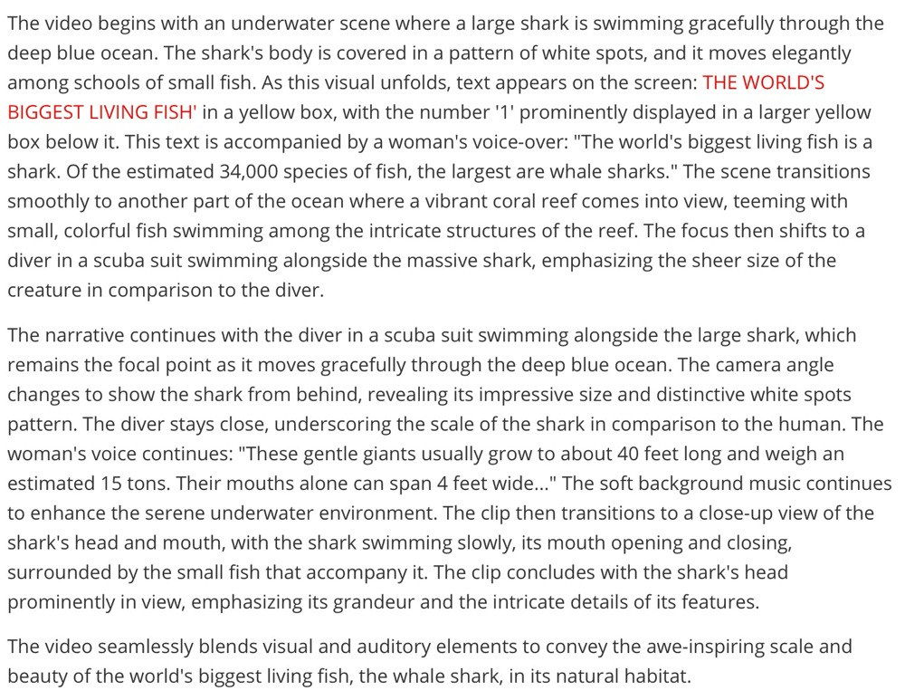
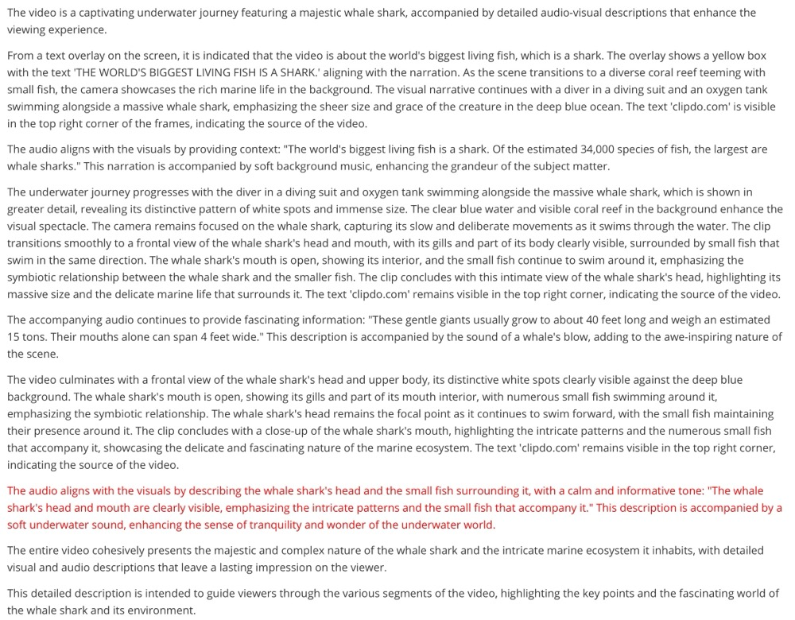
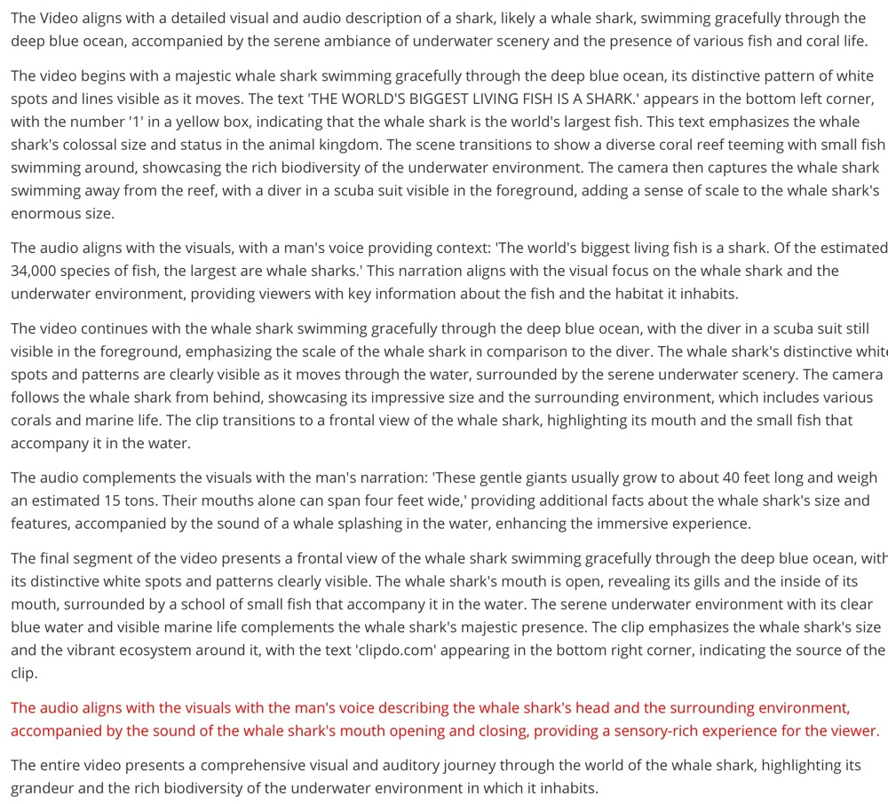

# Case Study

## Atomic events

1. The video begins with a whale shark swimming in the ocean.
2. The whale shark moves slowly through the water.
3. The number '1' in a yellow box apeears in the video.
4. The text 'THE WORLD'S BIGGEST LIVING FISH IS A SHARK.' appears in the video.
5. A vibrant coral reef teeming with small fish appears.
6. A woman says, "The world's biggest living fish is a shark. Of the estimated 34,000 species of fish, the largest are whale sharks."
7. Background music can be heard.
8. A diver swims near the whale shark.
9. The scene changes again, showing a diver swimming near the whale shark.
10. A woman's voice says, "These gentle giants usually grow to about 40 feet long and weigh an estimated 15 tons. Their mouths alone can span 4 feet wide."
11. The background music continues.
12. Text 'clideo.com' can be seen in the bottom right corner.
13. The scene changes, showing a close-up view of the whale shark's mouth.

## SFT Model

### Caption

### Analysis

1. The parts in red are where the model is misdescribed or hallucinated.

2. This caption omits Event 8: A diver swims near the whale shark.

## Round 3 DPO Model

### Caption

### Analysis

1. This red part omits "IS A SHARK".
2. The caption omits Event 12: Text 'clideo.com' can be seen in the bottom right corner.

## Round 6 DPO Model

### Caption

### Analysis

1. The red part is hallucination.
2. The overall description is complete.

## Rebirth Model

### Caption

### Analysis

1. The red part is hallucination.
2. The overall description is complete.
